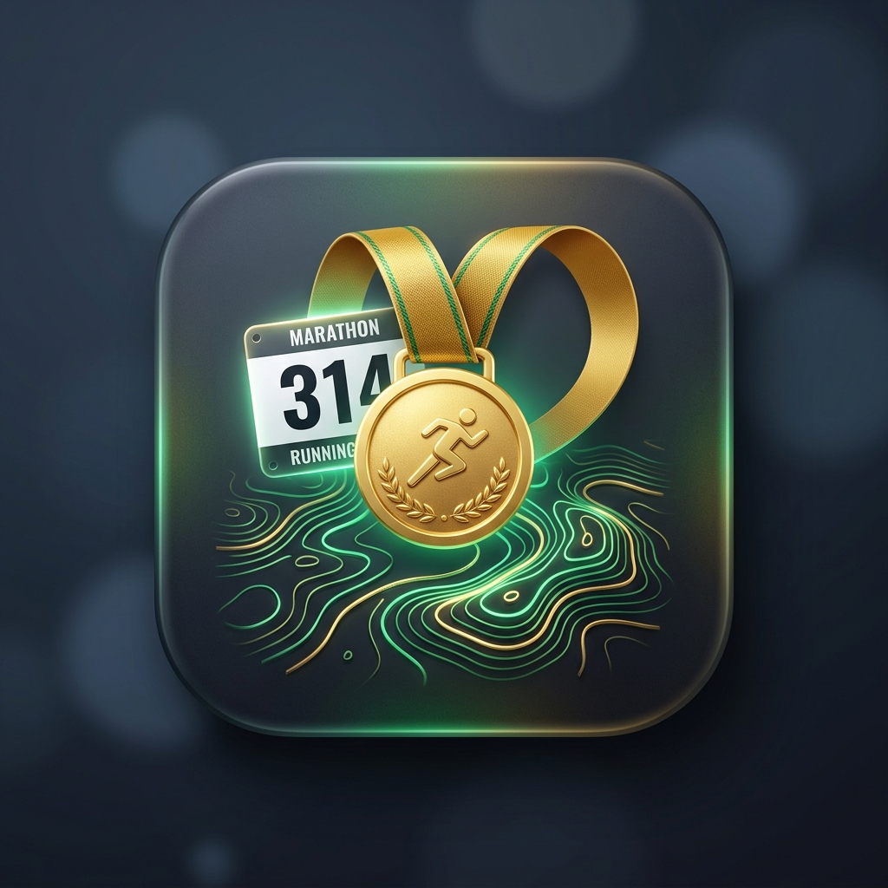

  

# Regional Running Races & Trails for Home Assistant 🏅📅

A Home Assistant integration powered by **Miles Republic** (`milesrepublic.com`) that automatically discovers and syncs upcoming official running, trail, triathlon, walking, obstacle, and cycling competitions into Home Assistant.

---

## ✨ Features
- 🌐 **Live Miles Republic Sync**: Automatically queries official event databases in real-time.
- 📍 **Multi-Department Filtering**: Select one or multiple French departments (e.g. 86 - Vienne, 79 - Deux-Sèvres, 37 - Indre-et-Loire, etc.).
- 🏃 **Discipline Selection**: Filter by Running, Trail, Marche / Rando, Triathlon / Duathlon, Vélo / Gravel, and Course d'obstacles.
- 📅 **Native Calendar (`calendar.courses_trails_...`)**: Displays all scheduled events with start times, distances, elevation gain, prices, and direct registration links.
- 🎯 **Next Race Sensor (`sensor.prochaine_course_officielle`)**: Countdown in days, next event name, location, and a complete list of upcoming races in `attributes.races` for rich Lovelace cards.
- ⚙️ **Full UI Configuration & Options Flow**: Modify your departments and sports choices at any time directly in Home Assistant.

---

## 🚀 Installation via HACS

1. In Home Assistant, open **HACS** > **Integrations** > **Custom repositories**.
2. Add this repository URL (`https://github.com/lediabloteur/ha-running-races`) with category **Integration**.
3. Download and restart Home Assistant if prompted.
4. Go to **Settings** > **Devices & Services** > **Add Integration** > search for **Regional Running Races & Trails**.
5. Select your department(s) and sports, and submit!

---

## ☕ Support the Project

If this integration helps you discover new races and trails in your region, consider supporting the project!

  

## 📄 License

This project is licensed under the **GNU General Public License v3.0 (GPLv3)** - see the [LICENSE](LICENSE) file for details.
